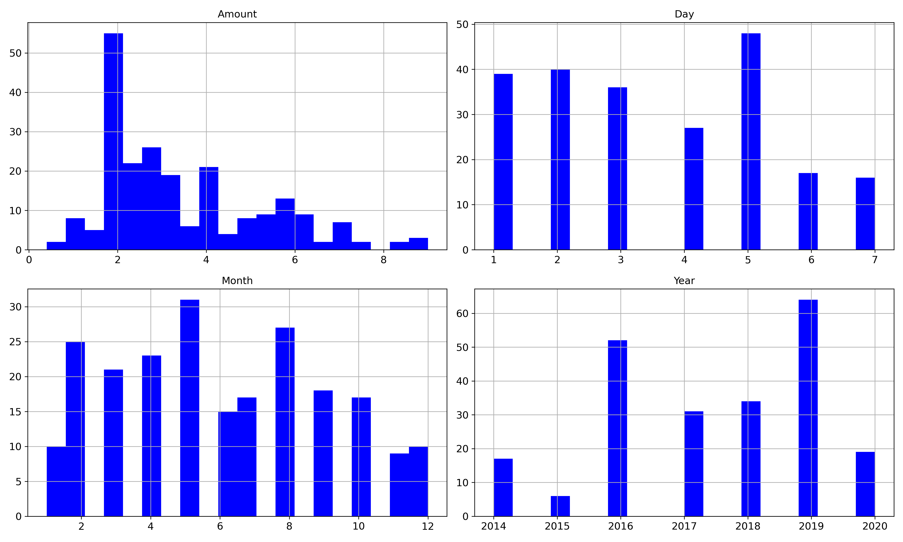
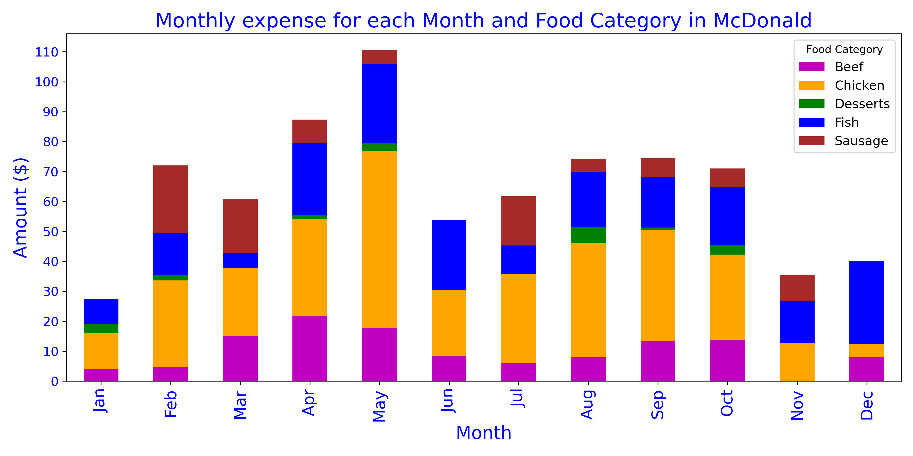

## Introduction

Using my own expenditure dataset that I've tracked over the last 6 years, I'm going to use it to predict how much I'll spend on McDonald based on the attributes: **Food Category** and **Month** in the dataset. The mobile app that I've used to track my expenditure is MoneyLover App: https://moneylover.me/.

I'll start by loading the dataset:


I'll be only taking the important attributes such as: ID, Notes, Amount, Category and the Date for this project.

As seen in the image below, there are 2 missing values in Notes out of 4983 non-null values.
Let's take a look at the what the null values are in the Notes category:

```
exp_dataset.info()

```
```
<class 'pandas.core.frame.DataFrame'>
Int64Index: 4985 entries, 4996 to 3551
Data columns (total 8 columns):
 #   Column          Non-Null Count  Dtype  
---  ------          --------------  -----  
 0   Notes           4983 non-null   object
 1   Amount          4985 non-null   float64
 2   Category        4985 non-null   object
 3   Account         4985 non-null   object
 4   Currency        4985 non-null   object
 5   Date            4985 non-null   object
 6   Event           4985 non-null   object
 7   Exclude Report  0 non-null      float64
dtypes: float64(2), object(6)
memory usage: 350.5+ KB

```

```
print("Number of null values for each column")
pd.DataFrame(exp_dataset.isnull().sum(), columns=["Null values"])
```
```
Null values
Notes 	2
Amount 	0
Category 	0
Account 	0
Currency 	0
Date 	0
Event 	0
Exclude Report 	4985
```

```
exp_dataset[exp_dataset["Notes"].isnull().values]
```


<br></br>

It looks like the null values are under the Driving Lessons and Salary Category.
As we are only getting the Food Category, we can ignore these as they'll be dropped.

## Getting the important attributes
I'll be getting only the most important Attributes:
* Notes
* Amount
* Category
* Date

Code below:
```
exp_data_1 = pd.DataFrame(exp_dataset, columns=["Notes", "Amount", "Category", "Date"])
exp_data_1.head()
```

</img>


I'll get the number of rows for the top 5 Categories and display them.
```
exp_data_1["Category"].value_counts()[:5]

Food & Beverage    3631
Investment          529
Gifts               199
Transportation       95
Entertainment        87
Name: Category, dtype: int64
```

It looks like Food & Beverage have the highest number of instances.

## Getting only the Food & Beverage Category
I'll only be getting the Food & Beverage Category. The following code extracts the **Food & Beverage** category.

    F_and_B = exp_data_1["Category"] == "Food & Beverage"
    exp_data_1 = exp_data_1[F_and_B]
    exp_data_1.head(10)


<br></br>

The **Amount** Category displays the (-) sign. It needs to be converted to positive. I'll be using the abs()
function to convert it to positive integers.

```
exp_data_1["Amount"]= exp_data_1["Amount"].abs()
exp_data_1.head()
```


## Getting the Date Time
I'm going to get the dates and have them split into:
* Days
* Month
* Quarterly Periods
* Years

Then, I'll insert them back into the dataframe and drop the "Date" attribute.

First, I'll get the Date attribute.

```
exp_data_1["Date"]
```

```
ID
4995    16/05/2020
4994    16/05/2020
4993    16/05/2020
4992    16/05/2020
4991    16/05/2020
           ...    
3540    12/04/2014
3550    10/04/2014
3549    10/04/2014
3548    10/04/2014
3546    10/04/2014
Name: Date, Length: 3631, dtype: object
```

Notice that the data type is an *object*. It needs to be converted to a *datetime64[ns]* format.

```
All_Date = pd.to_datetime(exp_data_1["Date"], dayfirst=True)
All_Date
```

```
ID
4995   2020-05-16
4994   2020-05-16
4993   2020-05-16
4992   2020-05-16
4991   2020-05-16
          ...    
3540   2014-04-12
3550   2014-04-10
3549   2014-04-10
3548   2014-04-10
3546   2014-04-10
Name: Date, Length: 3631, dtype: datetime64[ns]
```
Now, that it's converted, I can proceed with creating the Categorical Attributes: Days, Months, Quarterly Period and Years, for the "Date" Attribute.

Then, I'll add all these attributes back into the original dataset and drop the "Date" column.

## Splitting into the Quarterly, Monthly and Daily Period Columns

### Quarterly Period
To convert the Dates to quarterly periods, first I've to make a copy of the *exp_dataset_1*, this is to prevent making changes to the original dataset. Then, slice the "Date" column and convert it to Quarterly Periods.

```
exp_data_1_date = exp_data_1.copy()
exp_date_quarterly = exp_data_1_date["Date"].dt.to_period("Q")
exp_date_quarterly
```

```
ID
4995    2020Q2
4994    2020Q2
4993    2020Q2
4992    2020Q2
4991    2020Q2
         ...  
3540    2014Q2
3550    2014Q2
3549    2014Q2
3548    2014Q2
3546    2014Q2
Name: Date, Length: 3631, dtype: period[Q-DEC]
```
## Monthly
Similarly, I'll obtain the "Date" column and convert to months in their integer format.
```
exp_date_monthly = exp_data_1_date["Date"].dt.month
np.sort(pd.unique(exp_date_monthly))
```

```
array([ 1,  2,  3,  4,  5,  6,  7,  8,  9, 10, 11, 12], dtype=int64)
```

```
exp_date_monthly
```

```
ID
4995    5
4994    5
4993    5
4992    5
4991    5
       ..
3540    4
3550    4
3549    4
3548    4
3546    4
Name: Date, Length: 3631, dtype: int64
```

## Day of the week
I'll convert the "Date" to "Days" their integer format.

```
exp_date_days_1 = exp_data_1_date["Date"].dt.dayofweek+1
exp_date_days_1
```

```
ID
4995    6
4994    6
4993    6
4992    6
4991    6
       ..
3540    6
3550    4
3549    4
3548    4
3546    4
Name: Date, Length: 3631, dtype: int64
```

```
np.sort(pd.unique(exp_date_days_1))
```

```
array([1, 2, 3, 4, 5, 6, 7], dtype=int64)
```
<br>I've added +1 as the first day starts with 0. The integers corresponding to their day of the week are seen below.</br>

Mon: 1

Tue: 2

Wed: 3

Thu: 4

Fri: 5

Sat: 6

Sun: 7

## Year Column
Creating the "Year" column.
```
exp_date_yearly =exp_data_1_date["Date"].dt.year
exp_date_yearly
```

```
ID
4995    2020
4994    2020
4993    2020
4992    2020
4991    2020
        ...
3540    2014
3550    2014
3549    2014
3548    2014
3546    2014
Name: Date, Length: 3631, dtype: int64
```

# Insert the Days, Month, Quarterly Period and Year columns into the original dataset

```
exp_data_1.insert(3, "Day", exp_date_days_1)
exp_date_1.insert(4, "Month", exp_date_monthly)
exp_data_1.insert(5, "Quarterly Period", exp_date_quarterly)
exp_date_1.insert(6, "Year", exp_date_yearly)
exp_data_1
```


<br></br>

Next, we move on to creating the different food categories under the "Category" column

# Getting the McDonald's Food from Category column
Now, I've to obtain all of the McDonald Food from the "Notes" column.

First, I've identified that all McDonald's Food start with the string "McDonald" and thus, we obtain only the "Notes" with "McDonald" string in them. Also, I've specified the string to be non-case sensitive and disable regular expression

```
McDonald_Exp = exp_data_1[exp_data_1["Notes"].str.contains("McDonald", case=False, regex=False)]
McDonald_Exp.sort_index()
```

<br></br>

# Splitting the Category column into 5 different Categories

Now, I'll move on to Category column to split the "Food & Beverage" into 5 different categories:

* Fish
* Chicken
* Sausage
* Beef
* Dessert

## Obtaining the Fish category


```
McDonald_FishBurger = McDonald_Exp[McDonald_Exp["Notes"].str.contains("Fish"), case=False].copy()
McDonald_FishBurger["Notes"].value_counts()
```
```
McDonald's Filet O Fish Burger                          28
McDonald's Double Filet O Fish                          10
McDonald's Double Filet O Fish meal                      3
Sentosa McDonald's double file o fish                    1
Mcdonald filet fish Burger                               1
McDonald's Filet O Fish meal with criss cut fries        1
Mcdonald double fillet o fish meal                       1
McDonald's sweet chili fish burger                       1
McDonald's double Nacho fillet fish                      1
McDonald's Chili Lime Fish Burger                        1
McDonald's Double Filet O Fish meal with curly fries     1
McDonald's nacho fillet fish                             1
McDonald's Filet O Fish meal                             1
Name: Notes, dtype: int64
```
I've added the .copy() as it'll throw warning message about attempting to replace a string in a copy of a slice in the DataFrame.

Next, we'll replace the "Food & Beverage" string with "Fish"
```
McDonald_FishBurger.loc[:, "Category"] = "Fish"
McDonald_FishBurger.head()
```

**Show Image here**

<br>I'll do the same for the rest of the Food Category.</br>

## Obtaining the Chicken Burger category
```
McDonald_ChickenBurger = McDonald_Exp[McDonald_Exp["Notes"].str.contains("Chicken|nuggets|Mcnugget|mcwings|mcspicy|nasi lemak|Ha Ha",case=False, regex=False)].copy()
McDonald_ChickenBurger.head()
```

**Insert Image here**

Replace "Food & Beverage" string with "Chicken"

```
McDonald_ChickenBurger.loc[:, "Category"] == "Chicken"
McDonald_ChickenBurger.head()
```

I'm going to be dropping *herb chicken pie* from as I want it to fall under desserts.
Later on, they're are going to be some overlapping of the Categories which will create duplicate rows, which is why I dropped it. I'll explain it later when I remove the duplicates.


```
herb_chicken_pie = McDonald_ChickenBurger[McDonald_ChickenBurger["Notes"].str.contains("herb chicken", case=False)]
herb_chicken_pie
```

**Insert Picture here**

```
McDonald_ChickenBurger = McDonald_ChickenBurger.drop(herb_chicken_pie.index)
```

Please refer to the jupyter notebook for the remaining **Food Categories** as it's is the same as the above

# Concatenating the Food Categories all together

I'll concantenate all of the Food Categories.

```
Frames = [McDonald_FishBurger, McDonald_ChickenBurger, McDonald_Sausage, McDonald_Beef, McDonald_Desserts]
```

```
Combined_Food_Cat = pd.concat(Frames)
Combined_Food_Cat.sort_values(by="ID", ascending=False)
```

**Insert Picture**

```
Combined_Food_Cat["Category"].value_counts()
```

```
Chicken     104
Fish         51
Beef         32
Sausage      23
Desserts     20
Name: Category, dtype: int64
```

## Check if there are any "Food & Beverage" in Combined_Food_Cat

```
Combined_Food_Cat[Combined_Food_Cat["Category"] == "Food & Beverage"]
```

There aren't any.

## Checking for duplicate values in Combined_Food_Cat

As the ID, which is the index of the DataFrame, is the unique value for each food, I'll be using it to check for the duplicate values for the food.

```
Combined_Food_Cat[Combined_Food_Cat.index.duplicated(keep=False)].sort_index()
```


<br></br>

As mentioned earlier, the some of the food have their categories overlapped as some rows have 2 categories inside them. For simplicity, I'll be removing every second row and then append them back into the Combined_Food_Cat. There are all together 7 duplicate values.

Another way to check is if the *Combined_Food_Cat* and *McDonald_Exp*'s amount add up.

```
print("Total amount spent for Combined_Food_Cat",Combined_Food_Cat["Amount"].sum())
Total amount spent for Combined_Food_Cat 801.3
```

```
print("Total amount spent for McDonald_Exp",McDonald_Exp["Amount"].sum())
Total amount spent for McDonald_Exp 769.09
```

The duplicate values are giving them an additional $32.21. I'm going to remove them in the next step.

## Removing duplicate values in Combined_Food_Cat

I'm going to drop all of the duplicate values in Combined_Food_Cat by using *duplicate_values'* index

```
Combined_Food_Cat_new = Combined_Food_Cat.drop(index=duplicate_values.index)
len(Combined_Food_Cat)

216
```
Now that they're gone, I'm going to append back the *non_duplicate* values back to Combined_Food_Cat_new


```
Combined_Food_Cat_new = Combined_Food_Cat_new.append(non_duplicate, verify_integrity=True)
print("Total number of rows in Combined_Food_Cat_new:", len(Combined_Food_Cat_new)

Total number of rows in Combined_Food_Cat_new: 223
```

The number of rows are similiar to Combined_Food_Cat. I'll check if the amount are similar.

```
McDonald_Exp["Amount"].sum()

769.0999999
```

```
Combined_Food_Cat_new["Amount"].sum()

769.09999999
```

Finally, I'll check if there are duplicate values in Combined_Food_Cat_new

```
Combined_Food_Cat_new[Combined_Food_Cat_new.index.duplicated(keep=False)]


	Notes 	Amount 	Category 	Day 	Month 	Quarterly Period 	Year 	Date
ID 								
```

It's blank, so there are no more duplicate values.

I'll rename Category column to a more appropriate column *Food Category*

```
Combined_Food_Cat_new.rename({"Category":"Food Category"}, axis=1, inplace=True)
```

I'll check the columns

```
Combined_Food_Cat_new.columns

Index(['Notes', 'Amount', 'Food Category', 'Day', 'Month', 'Quarterly Period',
       'Year', 'Date'],
      dtype='object')
```

Looks good, the *Category* is renamed to *Food Category*. Now, I've to remove the *Date* column.

```
Combined_Food_Cat_new.drop("Date", axis=1, inplace=True)
Combined_Food_Cat_new.head()
```

<br></br>

## Gaining insights on McDonald's Data

I'll be plotting a histogram to show the *Amount* spent for *Day*, *Month*, *Year*.   


<br></br>

Some points to take from the histogram:
* The *Amount* highest concentration range from $2-3
* For *Days*, the highest is spent on Friday and the least on Saturday and Sunday coming close.
* For *Months*, there is a decrease in spending from September onwards
* For *Years*, highest expenditure is 2019, lowest being 2015

What's not shown in the histogram is the Quarterly Periods expenditure.
I'll shown it below with each *Food Category* for each Quarterly Period using a stacked bar chart.


<br></br>

Keypoints from the Quarterly McDonald Expense stacked bar charts

* Amount spent on Chicken has been show to be consistently high throughout the quarters.
* Amount spent on Desserts are the lowest throughout the quarters.
* There are at least 3 different Catgories spent on average for each quarter.

The below shows the scatter plot version of the graph


<br></br>


I'll be mainly focusing on the *amount*, *Food Category* and *months* attributes.

The following below shows the Attributes, Predictors and Labels.

Numerical Attribute:
* Amount

Categorical Attributes:
* Day, Months, Quarterly Period, Year


Predictors (X-axis)
Group by:
* Months
* ["Jan", "Feb", "Mar", "Apr", ...]

Food Category
* ["Beef", "Chicken", "Desserts", "Fish", "Sausage"]

Labels (Y-axis)
* Amount


# Group by Monthly Periods

As per the question posed earlier, given the Month and Food Category, predict how much I'll spend.

I'm going to gain insights on the *Month* and *Food Category*

I'll start by grouping the *Month* and *Food Category*

```
Monthly_McDonald_exp = Combined_Food_Cat_new[["Notes", "Food Category", "Month"]].groupby(["Month", "Food Category"]).sum()
Monthly_McDonald_exp
```


I'll create a list for Months which is later used to plot the graph

```
months = ["Jan", "Feb", "Mar", "Apr", "May", "Jun", "Jul", "Aug", "Sep", "Oct", "Nov", "Dec"]
```

I've to convert the index of the Monthly_McDonald_exp to a Series string which is later used to plot the x-axis graph.

```
Monthly_Periods = Monthly_McDonald_exp.index.to_series().astype("str")
Monthly_Periods[0]

"(1, 'Beef''s)"
```

```
plt.figure(figsize=(15,6))
plt.scatter(x=Monthly_Periods, y=Monthly_McDonald_exp, color="r")
plt.xticks(np.arange(len(Monthly_Periods)), Monthly_Periods, fontsize=14, rotation=14)

plt.xlabel("Month followed by Food Category", fontsize=19)
plt.ylabel("Amount ($)", fontsize=19)
save_fig("Month_Food_Cat_scatter_plot.png")
plt.show()
```


Now, I'll plot the stacked bar chart version of it.

```
Monthly_FoodCat.plot(kind="bar", stacked=True, figsize=(12,6), color=["m", "orange", "green", "Blue", "brown"])
plt.legend(["Beef", "Chicken", "Desserts", "Fish", "Sausage"], loc='best', title="Food Category", fontsize=12)
plt.xticks(np.arange(len(Monthly_FoodCat.index)), months, fontsize=15, color="b")
plt.yticks(np.arange(0,120,10), color="b")

plt.title("Monthly expense for each Month and Food Category in McDonald", fontsize=19, color="b")
plt.xlabel("Month", fontsize=17, color="b")
plt.ylabel("Amount ($)", fontsize=17, color="b")

save_fig("Month_Food_Cat_stacked_bar_chart")
plt.show()
```




key points to take note:
* Looks almost similar to the Quarterly expense chart
* Amount spent on *Chicken* is consistently present and high throughout the Months
* The least spent is on *Desserts*
* The least amount of Categories,3 Categories, were Jun, Nov, Dec

There are more insights which can be found in the Jupyter notebook, like the daily spendings.

Next, I'll start preparing and transforming the data.

## Stratified Shuffle Split
I'll have to split the data into training and test sets using **Stratified Shuffle Split**. This is to ensure that there is no sampling biases (The ratios of each Food Category remain the same after splitting)

```
from sklearn.model_selection import StratifiedShuffleSplit

split = StratifiedShuffleSplit(n_splits=1, test_size=0.2, random_state=42)

for train_index, test_index in split.split(Combined_Food_Cat_new, Combined_Food_Cat_new["Food Category"]):
    print("Train_index:", train_index)
    print()
    print("Test_index:", test_index)
    strat_train_set = Combined_Food_Cat_new.iloc[train_index]
    strat_test_set = Combined_Food_Cat_new.iloc[test_index]


Train_index: [179 160  56 182 105  74 222 207  18  70  72 206 187 138 205 152  27 161
  37 176  76 135 171  54 193  59   5  26 198  96 212  97 122 124  30   1
 125  86  67  49 131 214 208  28   0 189 100 106 116 107  61  93 156 130
  32  34   8  64 180 170  85  78  71  45 120 126  53  39  57 188 196  10
  50 151 144  80  58 163 101 115 217  62  75  13  91 197  82 114  88 165
 119 172  77  19 195 174  42 192 184  92 162   9 145 118  94 216 104 150
 142  44 203 173 155 191 211 134 220   7 136  21 166  81 141 168 137 153
 157 117  40  65  17   2 169 183 123 127   6 186 213 139 209  46 200  83
  60 175  23 132  79  68  16 221 133  35 218 111  20  24 194 102 113  43
  98  25  33  84 210  73 201 129  11  15  89 148  14 158 109   4]

Test_index: [ 29 140  48  47 108 219 121 143 202 204 147   3 181 167  90 128 178  69
  66  41  12 103 146  87  99  55 112  95  31  63 185 149 215  22 159 199
 190  52  36  38  51 177 154 164 110]
```

## Checking if the Food Category ratios are the same

### Training set ratios
```
strat_train_set["Food Category"].value_counts()/len(strat_train_set)

Chicken     0.466292
Fish        0.230337
Beef        0.140449
Sausage     0.101124
Desserts    0.061798
Name: Food Category, dtype: float64
```

### Test set ratios
```
strat_test_set["Food Category"].value_counts()/len(strat_test_set)

Chicken     0.466667
Fish        0.222222
Beef        0.133333
Sausage     0.111111
Desserts    0.066667
Name: Food Category, dtype: float64
```

### Original Data set

```
Combined_Food_Cat_new["Food Category"].value_counts()/len(Combined_Food_Cat_new)

Chicken     0.466368
Fish        0.228700
Beef        0.139013
Sausage     0.103139
Desserts    0.062780
Name: Food Category, dtype: float64
```

```
strat_train_set.head()
```


Looks good, the ratios looks almost similar for all the sets.

## Getting only Months, Food Category and Amount
Now, I'm only getting the *Month* and *Food Category* as the dependent variables and *Amount* as the independent variable.
```
strat_train_set = strat_train_set.drop(["Notes", "Day", "Quarterly Period", "Year"], axis=1)
strat_train_set
```


# Creating the predictors and labels

## Predictors

Predictors will be *Food Category* and *Month*. I'll convert the DataFrame into an array by adding `.values`.
`axis=1` means drop the columns with the name *Amount*.

```
McDonald_Exp_Predictors = strat_train_set_new.drop("Amount",axis=1).values
McDonald_Exp_Predictors

array([['Beef', 2],
       ['Sausage', 3],
       ['Chicken', 8],
       ['Beef', 5],
       ['Chicken', 5],
       ['Chicken', 3]], dtype=object)
```

Shape of `McDonald_Exp_Predictors`

```
McDonald_Exp_Predictors.shape

(178, 2)
```

## Labels
Now, I've to get the Labels, which is the *Amount* for the DataFrame and convert it to an array with a 178,1 shape.

```
McDonald_Exp_Labels = strat_train_set_new["Amount"].values.reshape(-1,1)
McDonald_Exp_Labels[:5]

array([[2.3],
       [3. ],
       [2. ],
       [2.6],
       [4. ]])
```

## Creating the numerical attribute pipeline
Next is to create the numerical attribute pipeline, which is to **standardize** the data. This is to ensure that the data does not behave badly as Algorithms such as RBF kernel of Support Vector or L1/L2 regularizers of linear models expect the individual features to more or less look like standard normally distributed data.

```
from sklearn.pipeline import Pipeline
from sklearn.preprocessing import StandardScaler

num_pipeline = Pipeline([
    ('std_scaler', StandardScaler())
    ])
```


```
McDonald_Exp_Labels_Transform = num_pipeline.fit_transform(McDonald_Exp_Labels_raw)
McDonald_Exp_Labels_Transform.shape

(178, 1)
```

```
McDonald_Exp_Labels_Transform[:6]

array([[-0.63176115],
       [-0.25376624],
       [-0.79375896],
       [-0.46976333],
       [ 0.28622648],
       [-0.68576042]])
```

# Creating the Categorical Attributes pipeline

Similar to the numerical pipeline, I've to create the Categorical Attribute to transform the Categorical attributes.

```
from sklearn.preprocessing import OneHotEncoder
cat_encoder = OneHotEncoder()
McDonald_exp_cat_1hot = cat_encoder.fit_transform(McDonald_Exp_Predictors)
McDonald_exp_cat_1hot

<178x17 sparse matrix of type '<class 'numpy.float64'>'
	with 356 stored elements in Compressed Sparse Row format>
```

A sparse matrix is created which holds the Categorical values for the attributes *Month* and *Food Category*.


```
cat_encoder.categories_

[array(['Beef', 'Chicken', 'Desserts', 'Fish', 'Sausage'], dtype=object),
 array([1, 2, 3, 4, 5, 6, 7, 8, 9, 10, 11, 12], dtype=object)]
```


```
McDonald_exp_cat_1hot.toarray()[0]

array([1., 0., 0., 0., 0., 0., 1., 0., 0., 0., 0., 0., 0., 0., 0., 0., 0.])
```

Now, that I've transformed the data. I can start to create the models to predict the *Amount*


# Select and train a model

## Using Linear Regression
